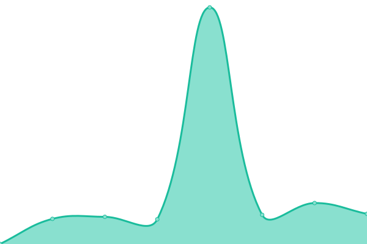

# [📈 Live Status](https://wesreckless.github.io/upptime-ams): <!--live status--> **🟩 All systems operational**

This repository contains the open-source uptime monitor and status page for [wesreckless](https://wesreckless.github.io/upptime-ams), powered by [Upptime](https://github.com/upptime/upptime).

With [Upptime](https://upptime.js.org), you can get your own unlimited and free uptime monitor and status page, powered entirely by a GitHub repository. We use [Issues](https://github.com/wesreckless/upptime-ams/issues) as incident reports, [Actions](https://github.com/wesreckless/upptime-ams/actions) as uptime monitors, and [Pages](https://wesreckless.github.io/upptime-ams) for the status page.

<!--start: status pages-->
<!-- This summary is generated by Upptime (https://github.com/upptime/upptime) -->
<!-- Do not edit this manually, your changes will be overwritten -->
<!-- prettier-ignore -->
| URL | Status | History | Response Time | Uptime |
| --- | ------ | ------- | ------------- | ------ |
|  [PST Sentraland](https://sent.sentraland.net) | 🟩 Up | [pst-sentraland.yml](https://github.com/wesreckless/upptime-ams/commits/HEAD/history/pst-sentraland.yml) | 

 295ms
     
 | 

<a href="https://wesreckless.github.io/upptime-ams/history/pst-sentraland">100.00%</a>
    

|  [PST Netuno](https://smsys.netuno.cl) | 🟩 Up | [pst-netuno.yml](https://github.com/wesreckless/upptime-ams/commits/HEAD/history/pst-netuno.yml) | 

 687ms
     
 | 

<a href="https://wesreckless.github.io/upptime-ams/history/pst-netuno">100.00%</a>
    

|  [PST Movistar](https://pst.movistar.cl:8443/PSTadmin/init.do) | 🟩 Up | [pst-movistar.yml](https://github.com/wesreckless/upptime-ams/commits/HEAD/history/pst-movistar.yml) | 

 651ms
     
 | 

<a href="https://wesreckless.github.io/upptime-ams/history/pst-movistar">100.00%</a>
    

<!--end: status pages-->

[**Visit our status website →**](https://wesreckless.github.io/upptime-ams)

## 📄 License

- Powered by: [Upptime](https://github.com/upptime/upptime)
- Code: [MIT](./LICENSE) © [Anand Chowdhary](https://anandchowdhary.com), supported by [Pabio](https://pabio.com)
- Data in the `./history` directory: [Open Database License](https://opendatacommons.org/licenses/odbl/1-0/)
