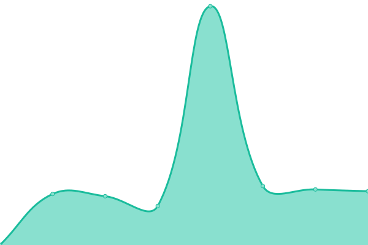
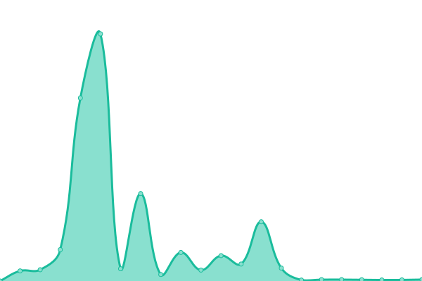
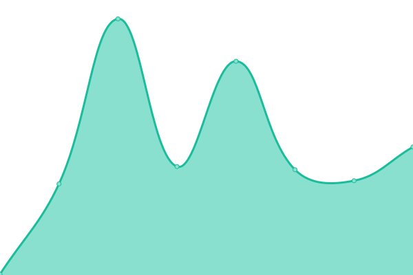

# [📈 Live Status](https://wesreckless.github.io/upptime-ams): <!--live status--> **🟧 Partial outage**

This repository contains the open-source uptime monitor and status page for [wesreckless](https://wesreckless.github.io/upptime-ams), powered by [Upptime](https://github.com/upptime/upptime).

With [Upptime](https://upptime.js.org), you can get your own unlimited and free uptime monitor and status page, powered entirely by a GitHub repository. We use [Issues](https://github.com/wesreckless/upptime-ams/issues) as incident reports, [Actions](https://github.com/wesreckless/upptime-ams/actions) as uptime monitors, and [Pages](https://wesreckless.github.io/upptime-ams) for the status page.

<!--start: status pages-->
<!-- This summary is generated by Upptime (https://github.com/upptime/upptime) -->
<!-- Do not edit this manually, your changes will be overwritten -->
<!-- prettier-ignore -->
| URL | Status | History | Response Time | Uptime |
| --- | ------ | ------- | ------------- | ------ |
|  [AMS](https://www.amsmobilesolutions.cl) | 🟥 Down | [ams.yml](https://github.com/wesreckless/upptime-ams/commits/HEAD/history/ams.yml) | 

 1515ms
     
 | 

<a href="https://wesreckless.github.io/upptime-ams/history/ams">100.00%</a>
    

|  [Sentraland](https://www.sentraland.net) | 🟩 Up | [sentraland.yml](https://github.com/wesreckless/upptime-ams/commits/HEAD/history/sentraland.yml) | 

 1217ms
     
 | 

<a href="https://wesreckless.github.io/upptime-ams/history/sentraland">100.00%</a>
    

|  [SMS Masivo](https://www.smsmasivo.net) | 🟥 Down | [sms-masivo.yml](https://github.com/wesreckless/upptime-ams/commits/HEAD/history/sms-masivo.yml) | 

 190ms
     
 | 

<a href="https://wesreckless.github.io/upptime-ams/history/sms-masivo">0.00%</a>
    

|  [Soporte Sentraland](https://soporte.sentraland.net) | 🟩 Up | [soporte-sentraland.yml](https://github.com/wesreckless/upptime-ams/commits/HEAD/history/soporte-sentraland.yml) | 

 168ms
     
 | 

<a href="https://wesreckless.github.io/upptime-ams/history/soporte-sentraland">100.00%</a>
    

|  [PST Sentraland](https://sent.sentraland.net) | 🟩 Up | [pst-sentraland.yml](https://github.com/wesreckless/upptime-ams/commits/HEAD/history/pst-sentraland.yml) | 

 203ms
     
 | 

<a href="https://wesreckless.github.io/upptime-ams/history/pst-sentraland">100.00%</a>
    

|  [PST Netuno](https://smsys.netuno.cl) | 🟩 Up | [pst-netuno.yml](https://github.com/wesreckless/upptime-ams/commits/HEAD/history/pst-netuno.yml) | 

 545ms
     
 | 

<a href="https://wesreckless.github.io/upptime-ams/history/pst-netuno">100.00%</a>
    

|  [PST Movistar](https://pst.movistar.cl:8443/PSTadmin/init.do) | 🟩 Up | [pst-movistar.yml](https://github.com/wesreckless/upptime-ams/commits/HEAD/history/pst-movistar.yml) | 

 597ms
     
 | 

<a href="https://wesreckless.github.io/upptime-ams/history/pst-movistar">100.00%</a>
    

|  [Convenios La Araucana](https://convenios.laaraucana.cl) | 🟩 Up | [convenios-la-araucana.yml](https://github.com/wesreckless/upptime-ams/commits/HEAD/history/convenios-la-araucana.yml) | 

 646ms
     
 | 

<a href="https://wesreckless.github.io/upptime-ams/history/convenios-la-araucana">100.00%</a>
    

|  [Essbio](https://www.essbio.cl) | 🟥 Down | [essbio.yml](https://github.com/wesreckless/upptime-ams/commits/HEAD/history/essbio.yml) | 

 121ms
     
 | 

<a href="https://wesreckless.github.io/upptime-ams/history/essbio">0.00%</a>
    

|  [Nuevosur](https://www.nuevosur.cl) | 🟥 Down | [nuevosur.yml](https://github.com/wesreckless/upptime-ams/commits/HEAD/history/nuevosur.yml) | 

 113ms
     
 | 

<a href="https://wesreckless.github.io/upptime-ams/history/nuevosur">0.00%</a>
    

|  [Club Metrogas](https://www.clubmetrogas.cl) | 🟩 Up | [club-metrogas.yml](https://github.com/wesreckless/upptime-ams/commits/HEAD/history/club-metrogas.yml) | 

 1112ms
     
 | 

<a href="https://wesreckless.github.io/upptime-ams/history/club-metrogas">100.00%</a>
    

|  [backcore.sentraland.net](https://backcore.sentraland.net) | 🟩 Up | [backcore-sentraland-net.yml](https://github.com/wesreckless/upptime-ams/commits/HEAD/history/backcore-sentraland-net.yml) | 

 160ms
     
 | 

<a href="https://wesreckless.github.io/upptime-ams/history/backcore-sentraland-net">100.00%</a>
    

|  [hospitalario.sentraland.net](https://hospitalario.sentraland.net) | 🟩 Up | [hospitalario-sentraland-net.yml](https://github.com/wesreckless/upptime-ams/commits/HEAD/history/hospitalario-sentraland-net.yml) | 

 157ms
     
 | 

<a href="https://wesreckless.github.io/upptime-ams/history/hospitalario-sentraland-net">100.00%</a>
    

|  [programas-medicos.sentraland.net](https://programas-medicos.sentraland.net) | 🟩 Up | [programas-medicos-sentraland-net.yml](https://github.com/wesreckless/upptime-ams/commits/HEAD/history/programas-medicos-sentraland-net.yml) | 

 157ms
     
 | 

<a href="https://wesreckless.github.io/upptime-ams/history/programas-medicos-sentraland-net">100.00%</a>
    

|  [subsidios.sentraland.net](https://subsidios.sentraland.net) | 🟩 Up | [subsidios-sentraland-net.yml](https://github.com/wesreckless/upptime-ams/commits/HEAD/history/subsidios-sentraland-net.yml) | 

 497ms
     
 | 

<a href="https://wesreckless.github.io/upptime-ams/history/subsidios-sentraland-net">100.00%</a>
    

|  [www.aconcaguatravel.cl](https://www.aconcaguatravel.cl) | 🟩 Up | [www-aconcaguatravel-cl.yml](https://github.com/wesreckless/upptime-ams/commits/HEAD/history/www-aconcaguatravel-cl.yml) | 

 402ms
     
 | 

<a href="https://wesreckless.github.io/upptime-ams/history/www-aconcaguatravel-cl">100.00%</a>
    

<!--end: status pages-->

[**Visit our status website →**](https://wesreckless.github.io/upptime-ams)

## 📄 License

- Powered by: [Upptime](https://github.com/upptime/upptime)
- Code: [MIT](./LICENSE) © [Anand Chowdhary](https://anandchowdhary.com), supported by [Pabio](https://pabio.com)
- Data in the `./history` directory: [Open Database License](https://opendatacommons.org/licenses/odbl/1-0/)
